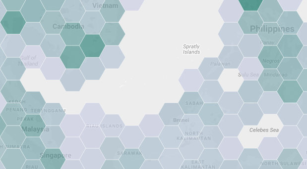

# Cloud Functions and Hex Binning

This demo shows how to integrate the Earth Engine JavaScript client library with
several other open-source tools:

-   Google [Cloud Functions](https://cloud.google.com/functions/), a serverless
    environment running Node.js.
-   [Turf.js](http://turfjs.org/), a JavaScript geospatial toolkit.
-   [D3.js](https://d3js.org/), a JavaScript data visualization library.

## Overview



**client.js** — Renders a map using the [Google Maps JavaScript
API](https://developers.google.com/maps/documentation/javascript/) and displays
a hex bin overlay for the visible regions, showing total population in each
cell. The overlay is provided as GeoJSON by a remote endpoint (see below) and
styled using D3.js.

**function.js** — Implements a remote endpoint for the client as a Cloud
Function using Node.js. The endpoint first computes hexagonal bins covering the
viewport using Turf.js and then computes total population for each bin using
the Earth Engine JavaScript client library. Computed bins and values are
returned to the client as GeoJSON.

> **NOTE:** Google Cloud Functions allow you to run backend code, similar
> to the Python API in App Engine, without the need to maintain (or pay for) a
> permanent server. Cloud Functions run on-demand — in this case, only when the
> client requests a group of hex bins — and shut down when inactive. This model
> is also known as serverless architecture.

## Quickstart

Installation:

```
npm install
```

### Cloud Function endpoint

[Create and authorize a Service
Account](https://developers.google.com/earth-engine/service_account), and put
your `.private-key.json` file in the project root folder. Next, test the
endpoint (Cloud Function) script locally:

```
npm test
```

If the test shows GeoJSON output without errors, you're ready to deploy the
endpoint as a Google Cloud Function, after creating a Cloud Platform project and
Cloud Storage bucket:

```
gcloud beta functions deploy hexPopHttp --trigger-http --project <project> --stage-bucket <bucket>
```

### Client webpage

Before running the client webpage, insert your Maps API key in `index.html`, and
(optionally) replace `CLOUD_FN_ENDPOINT` in `client.js` with your own Cloud
Function URL. Then:

```
npm run dev
```

A local demo will start at http://localhost:3000. To host a webpage in Cloud
Storage (or any other type of static hosting), run `npm run build` and upload
the contents of the `static` folder to your web host.

```
# Upload demo to Cloud Storage.
gsutil copy -r ./static/* gs://<bucket>/cloudfunctions-demo/

# Share demo resources publicly.
gsutil -m acl set -R -a public-read gs://<bucket>/cloudfunctions-demo/*
```

A public demo will start at
`https://storage.googleapis.com/<bucket>/cloudfunctions-demo/index.html`.
