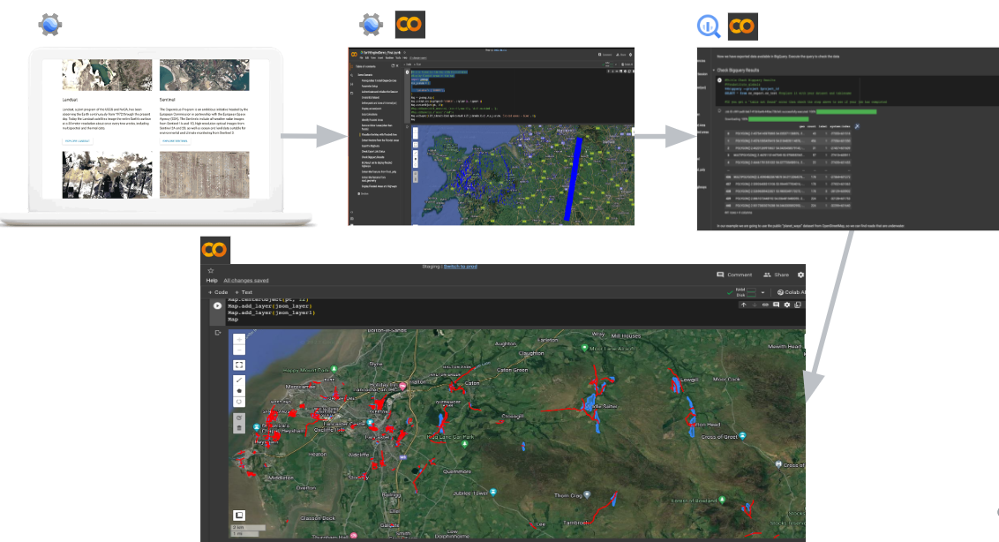

# Earth Engine to BigQuery Demo

This example shows how to build a simple Python pipeline to export data from
Earth Engine to BigQuery, working through an example of identify flooded roads
using Sentinel-1 radar data and OpenStreetMap roads.

## Process Flow

